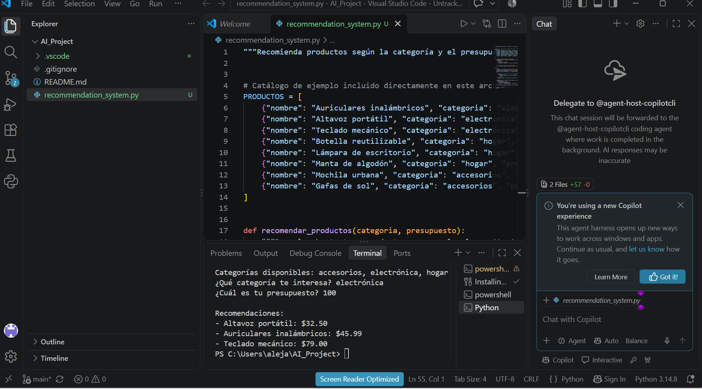

# Sistema de recomendación de productos

Este proyecto consiste en un sistema sencillo desarrollado en Python con apoyo de GitHub Copilot. El programa recomienda productos según la categoría elegida y el presupuesto ingresado por el usuario.

## Funcionamiento

1. Solicita una categoría: electrónica, hogar o accesorios.
2. Solicita el presupuesto disponible.
3. Filtra los productos que cumplen los criterios.
4. Ordena los resultados desde el precio más bajo.
5. Muestra hasta tres recomendaciones.

## Herramientas utilizadas

- Python
- Visual Studio Code
- GitHub Copilot
- Git y GitHub

## Evidencia de ejecución

En la siguiente captura se observa la ejecución del programa usando la categoría electrónica y un presupuesto de $100.

